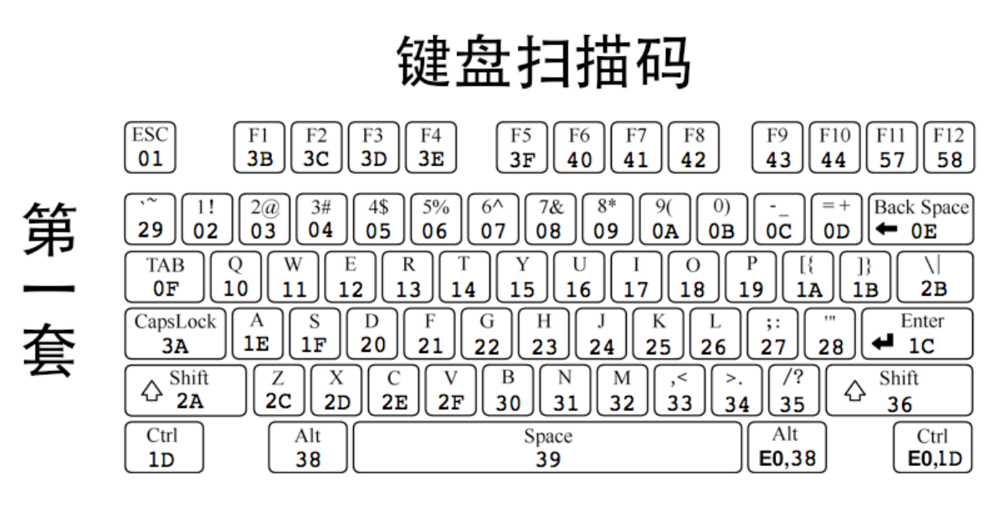

# 输入输出系统
### 锁
Q:为什么要有锁？
A:一种互斥的机制，互斥能使临界区具有原子性，避免产生竞争条件，从而避免了多任务访问公共资源时出问题

● 公共资源
可以是公共内存、公共文件、公共硬件等，总之是被所有任务共享的一套资源。
● 临界区
临界区是指程序中那些访问公共资源的指令代码，即临界区是指令，并不是受访的静态公共资源。
● 互斥
互斥也可称为排他，是指某一时刻公共资源只能被 1 个任务独享，即不允许多个任务同时出现在自己的临界区中。
● 竞争条件
竞争条件是指多个任务以非互斥的方式同时进入临界区，大家对公共资源的访问是以竞争的方式并行进行的，因此公共资源的最终状态依赖于这些任务的临界区中的微操作执行次序。

#### 信号量
*信号量就是个计数器，它的计数值是自然数，用来记录所积累信号的数量*

增加操作 up 包括两个微操作。
1. 将信号量的值加 1。
2. 唤醒在此信号量上等待的线程。
减少操作 down 包括三个子操作。
1. 判断信号量是否大于 0。
2. 若信号量大于 0，则将信号量减 1。
3. 若信号量等于 0，当前线程将自己阻塞，以在此信号量上等待
### 输入系统
每次 8048 向 8042 发扫描码的时候，8042 都会向中断代理（咱们是 8259A）发一次中断我们的键盘中断处理程序每次都会随着键盘发出的扫描码而去执行，也就是也会收到完整的击键过程，包括键的持续按压状态
过程： 
1. 当键位被按下(不弹起)
2. 8048 监控哪个键位被按下，8048 把键位对应的通码（用于描述一个键按下的码，断码就是描述一个键松开的码）发送给 8042，如果不松开，那么就持续发送
3. ​8042 接收到通码后，便知道具体哪个键位被按下了，对其进行处理，接着保存通码到自己的寄存器
4. 8042 接着向中断代理 8259A 发送中断，如果不松开，那么就持续发送中断
5. ​发生中断后，处理器执行对应的中断处理程序
 