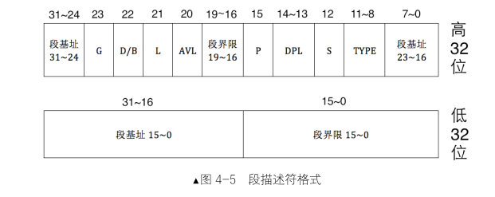
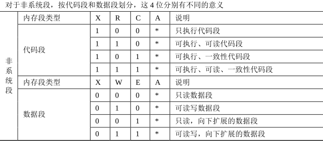
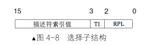

# **保护模式**
###  **bits**
***决定在汇编时把汇编码生成哪种机器码***
[bits 16]或[bits 32]
[bits 16]是编译成 16 位的机器码。
[bits 32]是编译成 32 位的机器码。
未使用 bits 指令的地方，默认是[bits 16]

### **0x66** 
***切换操作数大小***
假设当前运行模式是 16 位实模式，操作数大小将变为 32 位。
假设当前运行模式是 32 位保护模式，操作数大小将变为 16 位
### **0x67**
*** 寻址方式反转前缀***
如果想在 32 位模式下 使用 16 位内存地址（相当于 bx），你必须加上 0x67 前缀来反转地址模式：16位 同理
****
### **段描述符**
***一个段描述符只用来定义（描述）一个内存段***

G位 段界限的单位
D/B位 代码段、数据端的有效地址，以及操作数大小
L段，64位代码段标记位，32位下标记为0
AVL自定义需求
P P标志位，该段描述符指向的段是否在内存中
DPL 权限段0 → 最高权限（内核级）、3 → 最低权限（用户级
S位 系统段还是非系统段，代码段和数据段对CPU来说都是非系统段

### **全局描述符表GDT**
存放段描述符的表，位于内存中，用专门的寄存器GDTR来存储GDT的内存和大小
最多定义8192个描述符

### **选择子**
***确定段描述符位置的索引***

RPL 特权级 0 → 高权限、3 → 低权限（用户级）
TI 表示段选择子请求的段描述符是在GDT还是LDT中

lgdt:访问寄存器gdtr
lgdt 48位内存数据
****
### **打开保护模式的三个步骤**
1.加载全局描述符表
2.打开A20Gate，关闭地址回绕
3.PE设置为1
