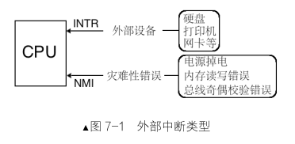
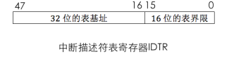
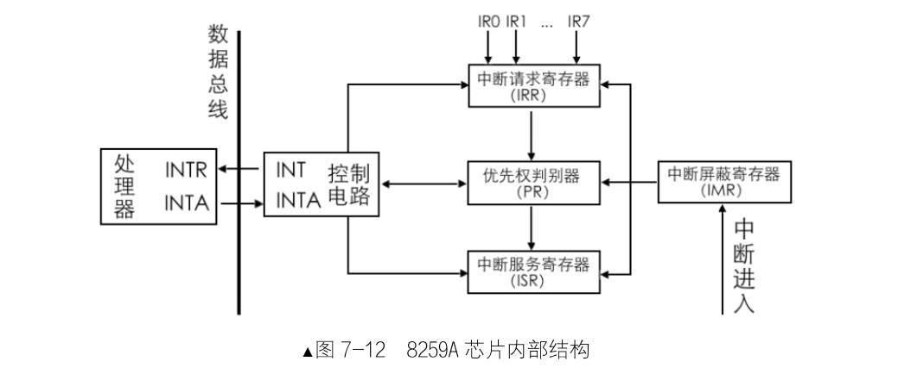

# 中断
**`CPU 获知了计算机中发生的某些事，CPU 暂停正在执行的程序，转而去执行处理该事件的程序，
当这段程序执行完毕后，CPU 继续执行刚才的程序。整个过程称为中断处理，也称为中断。`**

### 并发和并行的区别:
**并发**指的是单位时间内的累积工作量，比如每秒并发数是 100，这是指一秒内累积的请求量总和为 100 个请求，属于并发
**并行**是指真正同时进行的工作量，比如并行100 个请求量是指任意瞬间都有 100 个请求在发生，所以**单核 CPU 谈并发，多核 CPU 谈并行**

### 中断的分类
#### 一.外部中断
**`外部中断是来自cpu外部的中断，而外部的中断源必须是某个硬件，所以外部中断又称为硬件中断`**

CPU 中有两条接收中断的信号线：INTR和 NMI。也就是说所有的外部设备的中断信息都走一根信号线。只要从 INTR 引脚收到的中断都是不影响系统运行的，可以随时处理，甚至 CPU 可以不处理，假装没看见，因为它不影响 CPU 运行。而只要从 NMI 引脚收到的中断，那基本上全是硬伤，CPU 都没有运行下去的必要了。

##### 可屏蔽中断
可屏蔽中断是通过 INTR 引脚进入 CPU 的，外部设备如硬盘、网卡等发出的中断都是可屏蔽中断。
可屏蔽的意思是此外部设备发出的中断，CPU 可以不理会，因为它不会让系统宕机，

##### 不可屏蔽中断
不可屏蔽中断是通过 NMI 引脚进入 CPU 的，它表示系统中发生了致命的错误，它等同于宣布：计算机的运行到此结束了。

#### 二.内部中断

##### 软中断
就是由软件主动发起的中断，因为它来自于软件，所以称之为软中断

### 中断描述符表
中断描述符表（Interrupt Descriptor Table，IDT）是保护模式下用于存储中断处理程序入口的表

#### 门描述符
##### 一.任务门
任务门和任务状态段（Task Status Segment，TSS）是 Intel 处理器在硬件一级提供的任务切换机制，所以任务门需要和 TSS 配合在一起使用，在任务门中记录的是 TSS 选择子，偏移量未使用。
##### 二.中断门
中断门包含了中断处理程序所在段的段选择子和段内偏移地址。当通过此方式进入中断后，标志寄存器 eflags 中的 IF 位自动置 0，也就是在进入中断后，自动把中断关闭，避免中断嵌套
##### 三.陷阱门
陷阱门和中断门非常相似，区别是由陷阱门进入中断后，标志寄存器 eflags 中的 IF 位不会自动置 0。陷阱门只允许存在于 IDT 中。
##### 四.调用门
调用门是提供给用户进程进入特权 0 级的方式，其 DPL 为 3。

**除调用门外，另外的任务门、中断门、陷阱门都可以存在于中断描述符表中。**

#### lidt
lidt 48 位内存数据
在这 48 位内存数据中，前 16 位是 IDT 表界限，后 32 位是 IDT 线性基地址。

### 中断的过程
#### CPU 外
**外部设备的中断由中断代理芯片接收，处理后将该中断的中断向量号发送到 CPU。**
#### CPU 内
**CPU 执行该中断向量号对应的中断处理程序。（以下步骤）**
1. 处理器根据中断向量号定位中断门描述符
2. 处理器进行特权级检查
    a.软中断，用户进程主动发起的中断，由用户代码控制。检查特权级和DPL，即检查下限
    b.检查特权级的上限（门框）：处理器要检查当前特权级 CPL 和门描述符中所记录的选择子对应的目标代码段 DPL
3. 执行中断处理程序

#### Iret
此指令专用于从中断处理程序返回,从栈顶处往上的数据，每次 4 字节，对号入座弹出到相关寄存器

### 8259A可编程中断控制器
**8259A 的作用是负责所有来自外设的中断、管理和控制可屏蔽中断，它表现在屏蔽外设中断，对它们实行优先级判决，向 CPU 提供中断向量号等功能**

INT:8259A选出优先级最高的中断，发信号通知cpu
INTA：中断响应信号，8259A中的INTA接受来自cpu的INTA接口的中断响应信号
IMR：中断屏蔽寄存器，屏蔽某个外设的中断
IRR：中断请求寄存器，接受过滤后的中断信号并锁存，等待处理
PR：优先级仲裁器，比较中断，找出优先级更高的中断
ISR：中断服务寄存器，保存正在处理的中断

#### 初始化8259A
*进行初始化，设置主片与从片的级联方式，指定起始中断向量号以及设置各种工作模式*
1. 一部分是用 ICW （初始化命令字）做初始化，用来确定是否需要级联，设置起始中断向量号，设置中断结束模式。其编程就是往 8259A 的端口发送一系列 ICW
   ICW1 用来初始化 8259A 的连接方式和中断信号的触发方式。
   ICW2 用来设置起始中断向量号，就是前面所说的硬件 IRQ 接口到逻辑中断向量号的映射
   ICW3 仅在级联的方式下才需要（如果 ICW1 中的 SNGL 为 0）
   ICW4 用于设置 8259A 的工作模式，当 ICW1 中的 IC4 为 1 时才需要 ICW4
，用来设置主片和从片用哪个 IRQ 接口互连
2. 另一部分是用 OCW（操作命令字） 来操作控制 8259A，前面所说的中断屏蔽和中断结束，就是通过往 8259A 端口发送 OCW 实现的
   OCW1 用来屏蔽连接在 8259A 上的外部设备的中断信号
   OCW2 用来设置中断结束方式和优先级模式。
   OCW3 用来设定特殊屏蔽方式及查询方式

   # 时钟
   *使所有设备之间的通信井然有序，各通信设备间必须有统一的节奏，不能各干各的，这个节奏就称为定时或时钟*
   ### 内部时钟
   内部时钟是指处理器中内部元件，如运算器、控制器的工作时序，主要用于控制、同步内部工作过程的步调
   ### 外部时钟
   外部时钟是指处理器与外部设备或外部设备之间通信时采用的一种时序
   ### 可编程定时计数器 8253
   #### 计数器结构
   1. CLK 表示时钟输入信号，即计数器自己工作的节拍，也就是计数器自己的时钟频率。每当此引脚收到一个时钟信号，减法计数器就将计数值减 1
   2. GATE 表示门控输入信号，在某些工作方式下用于控制计数器是否可以开始计数
   3. OUT 表示计数器输出信号。当定时工作结束，也就是计数值为 0 时，根据计数器的工作方式，会在 OUT 引脚上输出相应的信号
   4. 计数初值寄存器用来保存计数器的初始
   5. 计数器执行部件是计数器中真正“计数”的部件，计数的工作是由计数器执行部件完成的
   6. 输出锁存器也称为当前计数值锁存器，用于把当前减法计数器中的计数值保存下来，其目的就是为了让外界可以随时获取当前计数值。
#### 计数器工作条件
计数器开始计数需要两个条件。
1. GATE 为高电平，即 GATE 为 1，这是由硬件来控制的。
2. 计数初值已写入计数器中的减法计数器，这是由软件out 指令控制的
当这两个条件具备后，计数器将在下一个时钟信号 CLK 的下降沿开始计数。