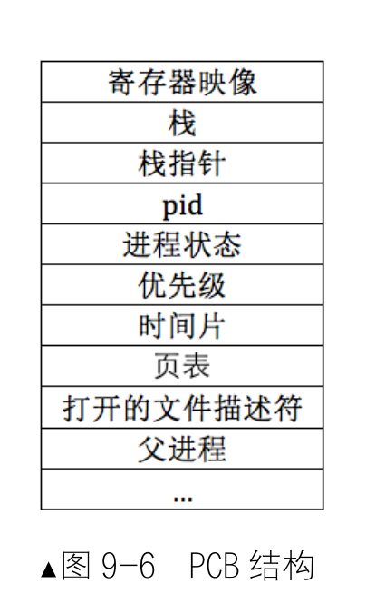

# 线程
*进程提供代码运行所需的资源和上下文环境，而线程是进程中真正被 CPU 调度、实际执行代码的单元*
### 进程与线程
*进程 = 资源 + 线程*
程序是指静态的、存储在文件系统上、尚未运行的指令代码，它是实际运行时程序的映像。

**进程**是指正在运行的程序，即进行中的程序，程序必须在获得运行所需要的各类资源后才能成为进程，
资源包括进程所使用的栈，使用的寄存器等。进程可分为单线程进程和多线程进程

**线程**是最小的执行单元

进程拥有整个地址空间，其中包括各种资源，而进程中的所有线程共享同一个地址空间

**PCB**，Process Control Block，即程序控制块,用它来记录与此进程相关的信息，比如进程状态、PID、优先级等.所有 PCB 放到一张表格中维护，这就是进程表,调度器可以根据这张表选择上处理器运行的进程，因此，PCB 又可称为进程表项。

**ABI**
不管被调函数中是否使用了这5个寄存器(ebp、ebx、edi、esi、和 esp)，在被调函数执行完后，这5个寄存器的值不该被改变。因此被调函数必须为主调函数保护好这5个寄存器的值，在被调函数运行完之后，这5寄存器的值必须和运行前一样，它必须在自己的栈中存储这些寄存器的值。

### 实现多线程
内核多线程的轮询调度，核心就4个：

1. 多线程要形成队列，调度是从队列中挑选pcb，通过pcb去运行线程；
2. main要把自己初始化成主线程与其他线程参与轮询调度；
3. 用时钟中断来打断线程的运行，然后统计线程运行的时间，由时钟中断来决定是否调度切换；
4. 有切换机制来完成线程之间的切换；

### 任务调度器
调度器主要任务就是读写就绪队列，增删里面的结点，结点是线程 PCB 中的 general_tag，“相当于”线程的 PCB，从队列中将其取出时一定要还原成 PCB 才行
因此，完整的调度过程需要三部分的配合。
（1）时钟中断处理函数。
（2）调度器 schedule。
（3）任务切换函数 switch_to。